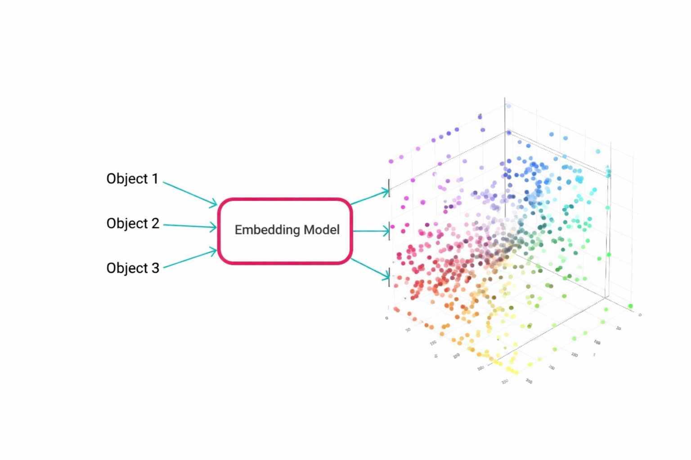
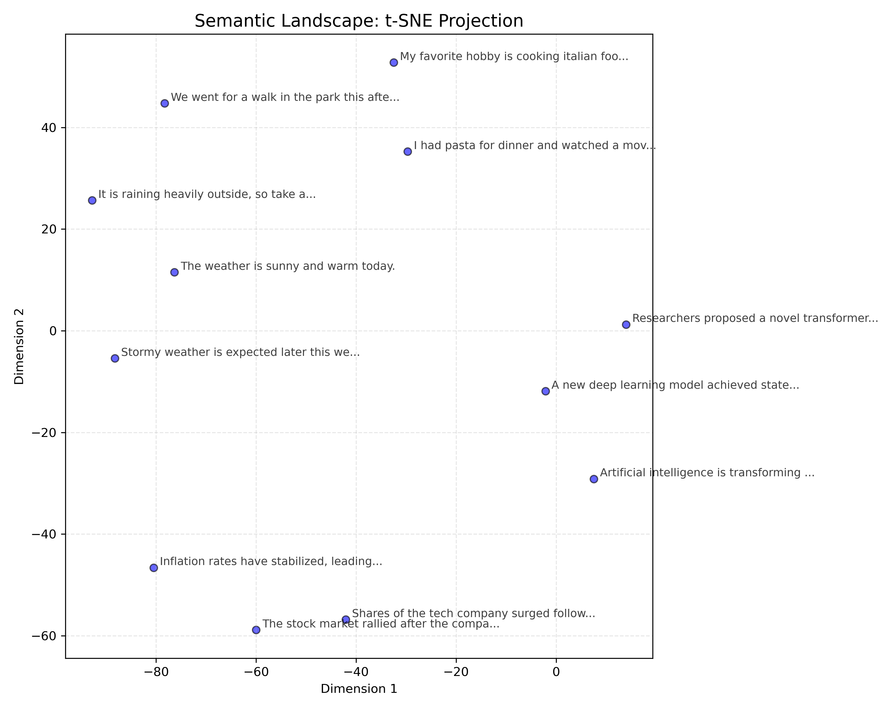

# Semantic Search & Latent Space Visualization 🧠

<p align="center">
  
  
  
</p>

This module explores the foundation of NLP: **Vector Embeddings**. It demonstrates how LLMs convert text into high-dimensional numerical representations and how we can visualize them in 2D space.

The script `sentence_similarity_visualizer.py` implements a complete pipeline for generating, comparing, and visualizing semantic clusters.

<p align="center">
  
</p>

## 🔍 Overview

Overall, it is important to understand how the model retrieves information. This tool visualizes the **Latent Space**. It is the mathematical space where similar concepts (like "Apple" the fruit and "Pear") are located close together, while distinct concepts (like "Apple" the "company") are far apart.

### Key Features
* **Embeddings:** Uses `sentence-transformers/all-MiniLM-L6-v2` to generate dense 384-dimensional vectors.
* **Semantic Similarity:** Calculates **Cosine Similarity** to quantify exactly how related two sentences are.
* **Dimensionality Reduction:** Implements **t-SNE** (t-Distributed Stochastic Neighbor Embedding) and **PCA** to project high-dimensional data into human-readable 2D scatter plots.
* **Automated Analysis:** Automatically identifies and prints the top most similar sentence pairs in the dataset.

## 🛠️ How It Works

The `EmbeddingAnalyzer` class performs the following workflow:

1.  **Ingest:** Loads a list of sentences (either from a `.txt` file or a built-in demo dataset containing clusters for Finance, AI, and Weather).
2.  **Encode:** Passes text through the Transformer model to create embeddings (Shape: `[N, 384]`).
3.  **Analyze:** Computes a similarity matrix ($N \times N$) to find the closest neighbors.
4.  **Visualize:** Reduces the 384 dimensions down to 2 dimensions and saves a `.png` plot.

## 📊 Sample Output

When running the script, the tool outputs the mathematical similarity scores between sentences:

```text
Loading model: sentence-transformers/all-MiniLM-L6-v2...
Encoding 12 sentences...

Top 3 Most Similar Pairs:
1. Score: 0.8245
   A: The stock market rallied after the company reported strong earnings.
   B: Shares of the tech company surged following positive quarterly results.

2. Score: 0.7612
   A: A new deep learning model achieved state-of-the-art performance.
   B: Researchers proposed a novel transformer architecture for NLP tasks.

3. Score: 0.6890
   A: The weather is sunny and warm today.
   B: It is raining heavily outside, so take an umbrella.
```

It also generates a 2D visualization where **semantic clusters become clearly visible**.

- The script saves the plot to:
  `outputs/YYYY-MM-DD_.../tsne_visualization.png`

<p align="center">
  
</p>

---

## 🚀 Usage

### 1) Run with Demo Data
By default, the script uses a curated list of diverse sentences to demonstrate semantic clustering.

```bash
python sentence_similarity_visualizer.py
```

### 2) Run with Custom Data
You can analyze your own text by providing a plain text file (one sentence per line).

```python
# Inside the __main__ block:
analyzer = EmbeddingAnalyzer(
    input_file="path/to/my_data.txt",
    reduction_method="tsne"
)
```

---

## 🔧 Technical Details

- **Model:** `all-MiniLM-L6-v2` (chosen for speed + strong semantic performance)
- **Distance Metric:** Cosine Similarity  
  $$
  \frac{A \cdot B}{\lVert A \rVert \ \lVert B \rVert}
  $$
- **Visualization:** t-SNE or PCA for dimensionality reduction.

---