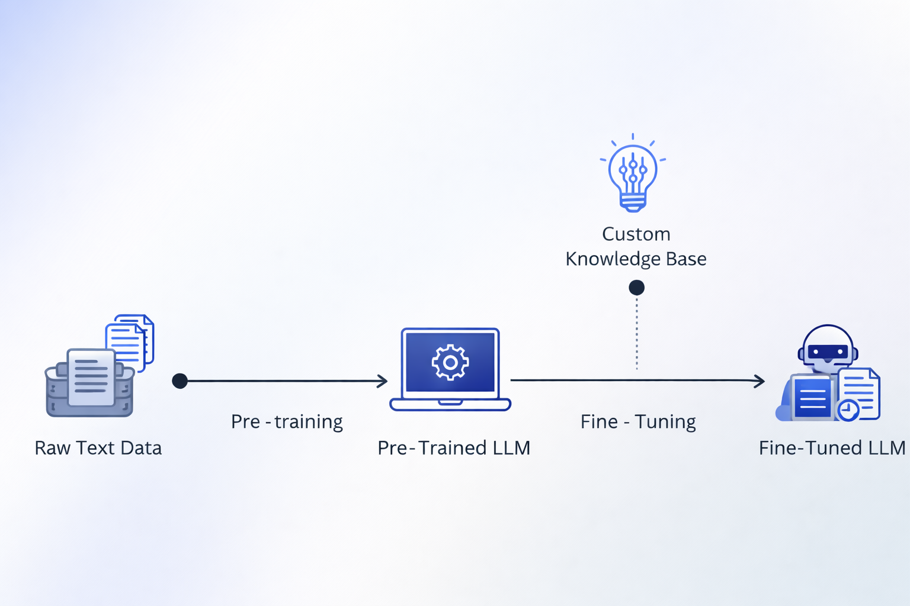

# Fine-Tuning Transformers 🔧

<p align="center">
  
  
  
</p>

This module demonstrates how to adapt foundation models (BERT, XLNet, DistilBERT) for specific downstream tasks using the **Hugging Face `Trainer` API**.

It moves beyond "prompt engineering" to actually modifying the model weights for domain-specific performance, covering two distinct NLP challenges: **Multi-Class Classification** and **Natural Language Inference (NLI)**.

<p align="center">
  
</p>

## 🔍 Overview

Fine-tuning is the process of taking a pre-trained LLM and training it further on a specific dataset. This directory contains two production-grade pipelines:

1.  **News Classifier:** Trains a model to categorize news articles into World, Sports, Business, or Sci/Tech.
2.  **Entailment Recognizer:** Trains a model to understand logic, whether one sentence logically implies another.

### Key Features
* **Dynamic Tokenization:** Uses `AutoTokenizer` with smart padding to handle variable-length text efficiently.
* **Rigorous Evaluation:** Tracks `Accuracy` and `F1 Score` during training to prevent overfitting.
* **Model Persistence:** Automatically saves the best-performing model checkpoint for future inference.
* **Inference Pipelines:** Includes built-in methods to load the saved model and predict on new, unseen text immediately.

## 📂 Scripts & Experiments

### 1. Topic Classification (`01_train_classifier.py`)
**Dataset:** `ag_news`
**Model:** Configurable (Defaults to `distilbert-base-uncased`, supports `xlnet`, `bert`, `roberta`).

This script implements a classic supervised learning workflow:
* **Input:** A single news headline/snippet.
* **Output:** One of 4 categories (World, Sports, Business, Sci/Tech).
* **Technique:** Fine-tunes the base model using the `Trainer` API with `accuracy` metrics.

### 2. Natural Language Inference (`02_train_classifier.py`)
**Dataset:** `glue` (subset: `rte`)
**Model:** `distilbert-base-cased`

This script handles a more complex "Sentence Pair" task:
* **Input:** Two sentences (Premise + Hypothesis).
* **Output:** `Entailment` (True) or `Not Entailment` (False).
* **Technique:** The tokenizer is specially configured to handle pairs: `tokenizer(sentence1, sentence2)`.

## 📊 Sample Output

For example when running `01_train_classifier.py`, the script outputs training logs and a final test prediction:

```text
Using device: CUDA
GPU: NVIDIA GeForce RTX 3060...

DATASET SUMMARY: ag_news
Split: train      | Rows: 120000   | Columns: ['text', 'label']
...
Training outcomes:
{'eval_loss': 0.245, 'eval_accuracy': 0.925, ...}

Classifying text:
'The new graphics card from Nvidia is a major breakthrough...'

Model Prediction(s):
[{'label': 'Sci/Tech', 'score': 0.984}, {'label': 'Business', 'score': 0.012}...]
```

Also, each script creates a timestamped run directory like:

```text
outputs/
├── YYYY-MM-DD_HH-MM-SS_<model>_finetuning_01/
│   ├── model/      # saved fine-tuned checkpoint
│   └── logs/       # Trainer logs + checkpoints
└── YYYY-MM-DD_HH-MM-SS_<model>_finetuning_02/
    ├── model/
    └── logs/
```

## 🚀 Usage

### 1) Train the News Classifier (AG News)

```bash
python 01_train_classifier.py
```

You can switch models by editing `SELECTED_MODEL` in the `__main__` block:

```python
MODELS = {
    "xlnet": "xlnet-base-cased",
    "bert": "bert-base-uncased",
    "roberta": "roberta-base",
    "distilbert": "distilbert-base-uncased",
    "deberta": "microsoft/deberta-base"
}

SELECTED_MODEL = "distilbert"  # <--- change this
```

---

### 2) Train the Entailment Model (GLUE/RTE)

```bash
python 02_train_classifier.py
```

This downloads the GLUE/RTE dataset, and saves the model under `outputs/`.

---

## 🔧 Technical Details

- **Framework:** PyTorch + Hugging Face Transformers
- **Tokenizer/Models:** `AutoTokenizer`, `AutoModelForSequenceClassification`
- **Optimization:** Trainer defaults (AdamW + linear schedule); weight decay is enabled in both scripts; warmup steps are set in the AG News script
- **Metrics:**
  - AG News: **Accuracy** (`evaluate`)
  - RTE: **Accuracy + F1** (`sklearn`)
- **Hardware:** uses **CUDA** when available (otherwise CPU)

---