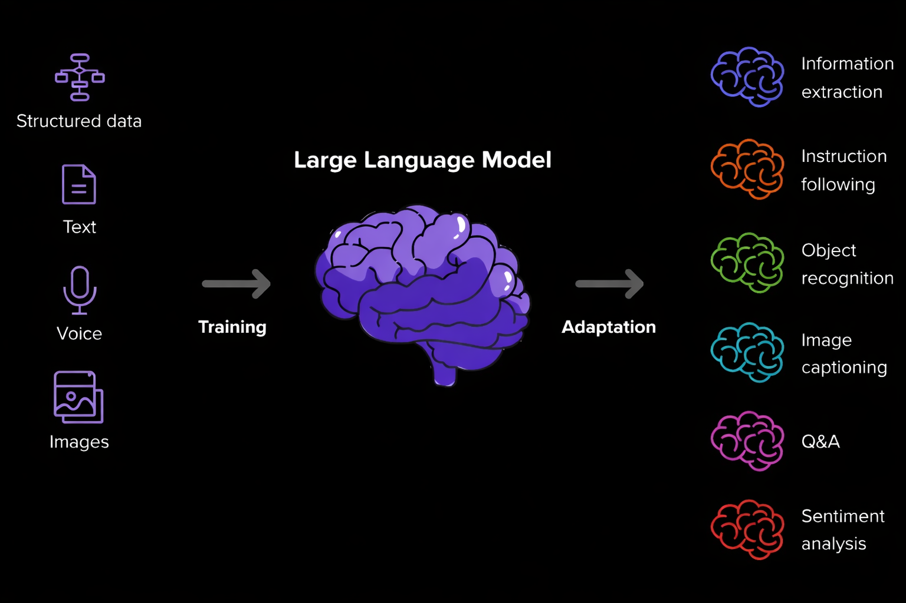

# My LLM Learning Journey 🚀

<p align="center">
  
  
</p>

This repository documents my hands-on journey into **Large Language Model (LLM) Engineering**. It serves as a practical codebase of my work in mastering modern NLP: **Semantic Search (Embeddings)**, **Retrieval-Augmented Generation (RAG)**, **Fine-Tuning**, and others.

The project is structured to show my progression from understanding data representation to building autonomous agents and customizing foundation models.

<p align="center">
  
</p>

## 🚀 About the Project

The goal of this repository is not just to run my examples but to build **production-grade** scripts that implement core LLM concepts.

Key implementations include:
* **Autonomous RAG Agents:** Systems that scrape live data (e.g., Wikipedia) to ground LLM answers in fact.
* **Fine-Tuning Workflows:** Customizing BERT/XLNet models for specific downstream tasks like News Classification and Textual Entailment.
* **Latent Space Visualization:** Exploring how models "think" by visualizing high-dimensional embeddings.

*Note: This repository is a living document. New modules and advanced techniques will be added as I progress.*

## ✨ Tech Stack

This project utilizes the modern AI engineering stack:

<p align="center">
  
  
  
  
  
  
  
</p>

---

## 🏗️ Project Structure

The repository is organized into three core modules, each focusing on a specific skill set.

```text
LLM-Learning-Journey/
├── Embeddings/               # 🧠 Semantic Search & Visualization
│   ├── sentence_similarity_visualizer.py
│   └── README.md
├── RAG/                      # 🤖 Retrieval-Augmented Generation Agents
│   ├── web_rag_agent.py
│   └── README.md
├── Fine_Tuning/              # 🔧 Model Adaptation & Training
│   ├── 01_train_classifier.py (AG News)
│   ├── 02_train_classifier.py (GLUE/RTE)
│   └── README.md
├── environment.yml           # Reproducible Conda environment
└── README.md                 # You are here!
```
---

## 🔧 Getting Started

### Prerequisites
This project uses **Conda** to manage dependencies, ensuring that GPU-accelerated libraries (like PyTorch/CUDA) install correctly.

### Installation

1.  **Clone the repository:**
    ```bash
    git clone [https://github.com/Tahernezhad/My-LLM-Learning-Journey.git](https://github.com/Tahernezhad/My-LLM-Learning-Journey.git)
    cd My-LLM-Learning-Journey
    ```

2.  **Create the Environment:**
    ```bash
    conda env create -f environment.yml
    ```

3.  **Activate:**
    ```bash
    conda activate llm
    ```

## 🔮 Future Roadmap

This repository is **actively evolving** as part of an ongoing LLM learning plan. Planned extensions include:


- More advanced **embedding models** and visualizations (clustering, dimensionality reduction).
- Richer **RAG pipelines** with chunking strategies, vector databases, valuation of answer quality, re-ranking and hybrid search
- Additional **fine‑tuning experiments**, such as class imbalance handling, hyperparameter sweeps, and comparison of different backbone models.

This repository serves as a living record of my technical journey. It is designed to demonstrate my practical ability to engineer robust, and reproducible NLP solutions.

---